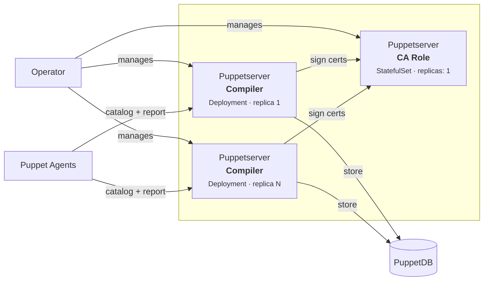

# openvox-operator

A Kubernetes Operator for running OpenVox Server environments on Kubernetes and OpenShift. Manages the full lifecycle: CA initialization, certificate distribution, compiler scaling, and PuppetDB integration.

The container images are rootless, built on UBI9 without ezbake, and work with OpenShift's random UID assignment out of the box.

## Architecture

> Detailed diagrams: [docs/architecture.md](docs/architecture.md) | [draw.io](docs/architecture.drawio)



All Puppetserver instances use the **same container image**. The Operator assigns the role (CA or Compiler) via ConfigMap and service configuration. The CA runs as a StatefulSet (exactly 1 replica with persistent storage), compilers run as a scalable Deployment.

### Design Principles

- **Kubernetes-first**: All configuration via ConfigMaps/Secrets, no ENV-var-to-config translation scripts
- **No ezbake**: Direct JVM startup, no `runuser`/`su`/`sudo`, no init scripts
- **No Docker-Compose support**: Use `kind` or `minikube` for local testing with the same K8s manifests
- **Rootless**: OpenShift random UID compatible (`USER 1001:0`, `chgrp 0`, `chmod g=u`, SGID)
- **No System Ruby for config**: The entrypoint.d scripts that called `puppet config set/print` are replaced by operator-generated ConfigMaps
- **Split CA / Compiler**: CA runs as StatefulSet (replicas: 1), compilers as scalable Deployment

## Quick Start

### Build the Image

```bash
cd images/openvoxserver
podman build -t openvoxserver:rootless .
```

### Deploy with the Operator

```bash
# Install CRD
kubectl apply -f config/crd/bases/

# Deploy the operator
kubectl apply -f config/manager/

# Create an OpenVox environment
kubectl apply -f config/samples/openvox_v1alpha1_openvoxserver.yaml
```

### Deploy with Plain Manifests

```bash
kubectl apply -f examples/kubernetes/
kubectl wait --for=condition=ready pod -l app.kubernetes.io/name=openvoxserver --timeout=300s
```

## Custom Resource Definition

The operator manages `OpenVoxServer` custom resources:

```yaml
apiVersion: openvox.voxpupuli.org/v1alpha1
kind: OpenVoxServer
metadata:
  name: production
  namespace: openvox
spec:
  image:
    repository: ghcr.io/slauger/openvoxserver
    tag: "8.12.1"

  ca:
    enabled: true
    autosign: "true"
    ttl: 157680000
    allowSubjectAltNames: true
    certname: "puppet"
    dnsAltNames:
      - puppet
      - puppet-ca
      - puppet-ca.openvox.svc
    storage:
      size: 1Gi
    resources:
      requests: { memory: "1Gi", cpu: "500m" }
      limits:   { memory: "2Gi", cpu: "1500m" }
    javaArgs: "-Xms512m -Xmx1024m"

  compilers:
    replicas: 2
    dnsAltNames:
      - puppet
      - puppet.openvox.svc
    resources:
      requests: { memory: "1Gi", cpu: "500m" }
      limits:   { memory: "2Gi", cpu: "1500m" }
    javaArgs: "-Xms512m -Xmx1024m"
    maxActiveInstances: 2

  puppet:
    serverPort: 8140
    environmentPath: /etc/puppetlabs/code/environments
    environmentTimeout: unlimited
    hieraConfig: "$confdir/hiera.yaml"
    storeconfigs: true
    storeBackend: puppetdb
    reports: puppetdb

  puppetdb:
    enabled: true
    serverUrls:
      - https://openvoxdb:8081

  code:
    volume:
      size: 5Gi
```

### Status

```bash
$ kubectl get openvoxserver
NAME         PHASE     CA READY   COMPILERS   AGE
production   Running   true       2           5m
```

## Reconciliation Flow

1. Operator reads `OpenVoxServer` CR
2. Generates ConfigMaps from `spec.puppet.*` (puppet.conf, puppetdb.conf, webserver.conf, etc.)
3. If `ca.enabled` and no CA Secret exists: creates CA Setup Job (`puppetserver ca setup`)
4. Waits for Job completion, CA certificates are stored in a Secret
5. Creates CA StatefulSet (replicas: 1, PVC for CA data)
6. Waits for CA readiness
7. Creates Compiler Deployment (replicas: N, CA Secret mounted)
8. Compilers bootstrap SSL via `puppet ssl bootstrap` against the CA Service

## Container Image

The image is intentionally slim for Kubernetes deployments:

### Included

- UBI9 base + JDK 17
- OpenVox Server tarball (puppet-server-release.jar, CLI tools, vendored JRuby gems)
- PuppetDB termini
- `puppetserver gem install openvox` (JRuby)
- openvoxserver-ca patches (chown/symlink disabled for rootless)
- OpenShift random-UID pattern

### Removed (compared to upstream container-openvoxserver)

- All entrypoint.d scripts (config comes via ConfigMap)
- System Ruby openvox gem (no `puppet config set/print`)
- Gemfile / bundle install / ruby-devel / gcc / make
- ENV-var to config translation logic
- Docker-Compose support

### Entrypoint

```bash
exec java ${JAVA_ARGS} \
    --add-opens java.base/sun.nio.ch=ALL-UNNAMED \
    --add-opens java.base/java.io=ALL-UNNAMED \
    -Dlogappender=STDOUT \
    -cp "${INSTALL_DIR}/puppet-server-release.jar" \
    clojure.main -m puppetlabs.trapperkeeper.main \
    --config "${CONFIG}" \
    --bootstrap-config "${BOOTSTRAP_CONFIG}"
```

## Project Structure

```
openvox-operator/
├── images/
│   └── openvoxserver/
│       ├── Containerfile            # Rootless K8s-first image (UBI9)
│       ├── entrypoint.sh            # Minimal entrypoint (direct java)
│       └── healthcheck.sh
├── api/
│   └── v1alpha1/
│       ├── groupversion_info.go
│       ├── openvoxserver_types.go   # CRD type definitions
│       └── zz_generated.deepcopy.go
├── cmd/
│   └── main.go                      # Operator entrypoint
├── internal/
│   └── controller/
│       ├── openvoxserver_controller.go  # Main reconciliation loop
│       ├── configmap.go             # ConfigMap generation
│       ├── ca.go                    # CA Job/StatefulSet/Service
│       └── compiler.go             # Compiler Deployment/Service
├── config/
│   ├── crd/bases/                   # Generated CRD manifests
│   ├── rbac/                        # RBAC roles
│   ├── manager/                     # Operator deployment
│   └── samples/                     # Example CRs
├── examples/
│   └── kubernetes/                  # Plain K8s manifests (no operator)
├── docs/
│   └── architecture.drawio          # Architecture diagram
├── go.mod
├── LICENSE                          # Apache 2.0
└── README.md
```

## Roadmap

- [x] Rootless OpenVox Server container image (UBI9, tarball-based)
- [x] Kubernetes Operator scaffolding (CRD, controller, reconciliation loop)
- [ ] Simplify container image (remove entrypoint.d, Gemfile, System Ruby)
- [ ] CRD manifest generation and RBAC
- [ ] r10k integration (initContainer / CronJob)
- [ ] HPA for compilers
- [ ] cert-manager intermediate CA support
- [ ] OLM bundle for OpenShift
- [ ] Rootless OpenVox DB container image

## License

Apache License 2.0
