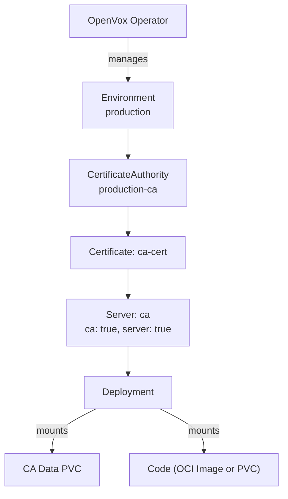
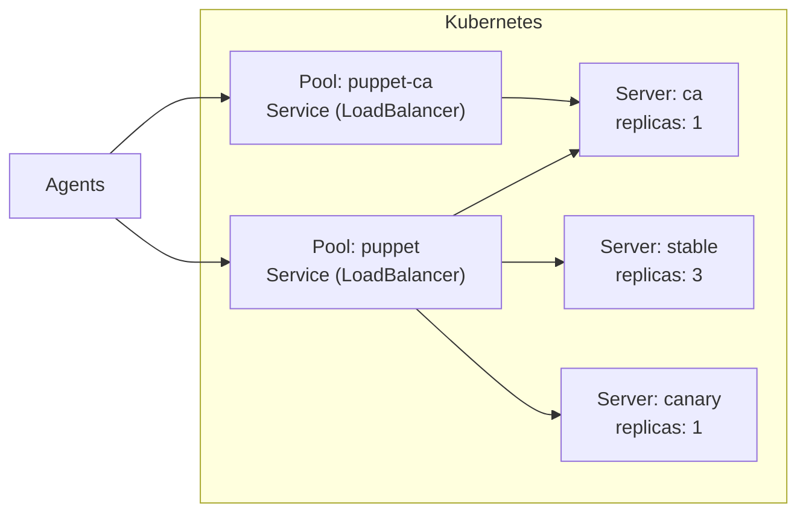
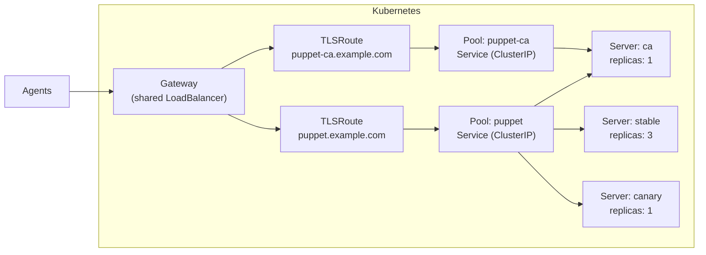

# OpenVox Operator

A Kubernetes Operator that maps [OpenVox Server](https://github.com/OpenVoxProject) infrastructure onto native building blocks - CRDs, Secrets, OCI image volumes, and Gateway API - for running Puppet on **Kubernetes** and **OpenShift**.

## Features

- 🔐 **Automated CA Lifecycle** - CA initialization, certificate signing, distribution, and periodic CRL refresh - fully managed
- 📜 **Declarative Signing Policies** - CSR approval via patterns, CSR attributes, or open signing - no autosign scripts
- 📦 **One Image, Two Roles** - Same rootless image runs as CA or server, configured by the operator
- ⚡ **Scalable Servers** - Scale catalog compilation horizontally with multiple server pools and HPA
- 🔄 **Multi-Version Deployments** - Run different server versions side by side for canary deployments and rolling upgrades
- 🔒 **Rootless & OpenShift Ready** - Random UID compatible, no root, no ezbake, no privilege escalation
- 🪶 **Minimal Image** - UBI9-based, no system Ruby, no ezbake packaging - smaller footprint, fewer updates
- 🧠 **Auto-tuned JVM** - Heap size calculated from memory limits (90%) - no manual `-Xmx` tuning needed
- 📦 **OCI Image Volumes** - Package Puppet code as OCI images, deploy immutably with automatic rollout (K8s 1.31+)
- 🌐 **Gateway API** - SNI-based TLSRoute support - share a single LoadBalancer across environments via TLS passthrough
- 🔃 **Automatic Config Rollout** - Config and certificate changes trigger rolling restarts automatically
- ☸️ **Kubernetes-Native** - All config via ConfigMaps/Secrets, no entrypoint scripts, no ENV translation

## How It Works

The operator manages OpenVox Server environments through a set of Custom Resource Definitions (CRDs):

| Kind | Purpose | Creates |
|---|---|---|
| **Environment** | Shared config (puppet.conf, auth.conf, etc.), PuppetDB connection | ConfigMaps, Secrets, ServiceAccount |
| **CertificateAuthority** | CA infrastructure: keys, signing, split Secrets (cert, key, CRL) | PVC, Job, ServiceAccount, Role, RoleBinding, 3 Secrets |
| **SigningPolicy** | Declarative CSR signing policy (any, pattern, CSR attributes) | *(rendered into Environment's autosign Secret)* |
| **Certificate** | Lifecycle of a single certificate (request, sign) | TLS Secret |
| **Server** | OpenVox Server instance pool (CA and/or server role) | Deployment |
| **Pool** | Service + optional Gateway API TLSRoute for Server Pods | Service, TLSRoute (optional) |

An **Environment** holds shared configuration, connects to PuppetDB, and manages [code deployment](concepts/code-deployment.md) via OCI image volumes or PVCs. A **CertificateAuthority** manages the CA infrastructure (PVC, setup Job, split Secrets for cert/key/CRL) and periodically refreshes the CRL. **SigningPolicy** resources define declarative rules for CSR approval (including DNS SAN validation). **Certificate** resources manage the lifecycle of individual certificates. **Server** resources reference a Certificate and can run as CA, server, or both. A **Pool** creates a Kubernetes Service that selects Server pods by label, with optional [Gateway API TLSRoute](concepts/gateway-api.md) support for SNI-based routing across a shared LoadBalancer.

An **Environment** is the root resource - it holds shared configuration (puppet.conf, PuppetDB connection) and manages code deployment. A **CertificateAuthority** initializes the CA infrastructure and periodically refreshes the CRL. Each **Certificate** is signed by the CA and stored as a Kubernetes Secret. A **Server** references a Certificate and creates a Deployment - it can run as CA, catalog server, or both. **Pools** create Services that select Server pods by label, with optional [Gateway API TLSRoute](concepts/gateway-api.md) for SNI-based routing.

Puppet code is mounted into Server pods via **OCI image volumes** (immutable, automatic rollout on image change, K8s 1.31+) or a **PVC** (mutable, externally managed). See [Code Deployment](concepts/code-deployment.md) for details.

## Traffic Flow

Each Pool owns a Kubernetes Service that selects Server pods. The CA server can participate in both pools - handling CA requests via its dedicated pool and also serving catalog requests through the server pool.

**LoadBalancer Services** - each Pool gets its own external IP:

**Gateway API TLSRoute** - all Pools share a single LoadBalancer, routed by SNI hostname:

## License

Apache License 2.0
